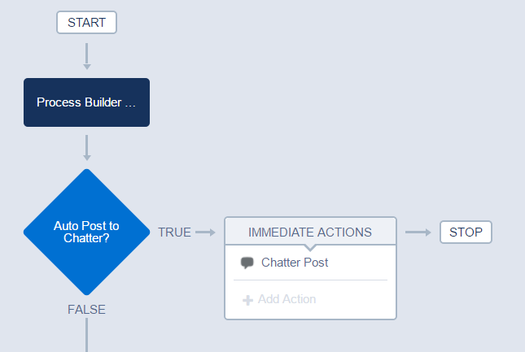
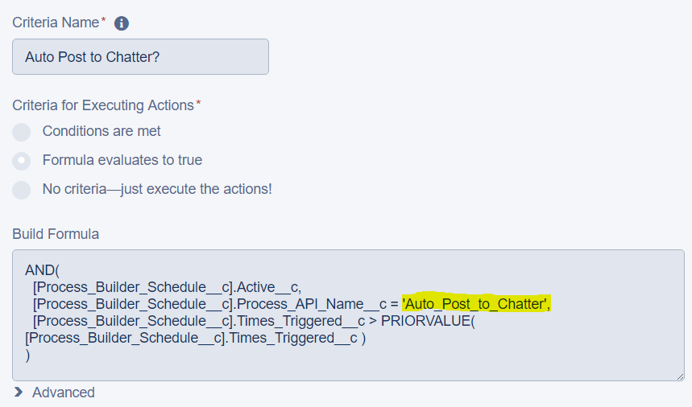
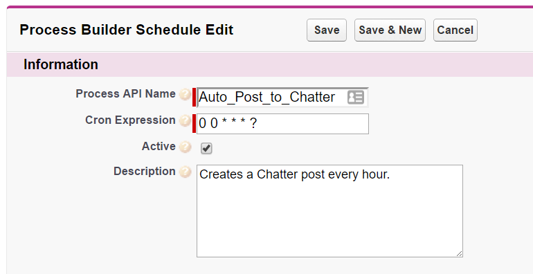

New Tool Available (January 2018)
---------------------------------

I've developed a new, more robust tool, [Mass Action Scheduler](https://github.com/DouglasCAyers/sfdx-mass-action-scheduler), that lets you declaratively schedule Process Builder, Flows, Quick Actions, Email Alerts, Workflow Rules, and Apex to process records from Reports and List Views.

Check out the [examples](https://github.com/DouglasCAyers/sfdx-mass-action-scheduler/wiki/Example:-Add-Contacts-to-Campaign-via-Report-and-Process-Builder) to see how.

---

Process Builder Scheduler
=========================

Provides a declarative way to schedule process builder to run at arbitrary times.

Inspired by **Marie Chandra's** idea [Ability to schedule when process builder triggers](https://success.salesforce.com/ideaView?id=08730000000DjEmAAK).

Installation
------------
You can easily install these components to your org straight from github or as an unmanaged package.
* [Deploy from Github](https://githubsfdeploy.herokuapp.com)
* [Production URL](https://login.salesforce.com/packaging/installPackage.apexp?p0=04tj0000001ejTg)
* [Sandbox URL](https://test.salesforce.com/packaging/installPackage.apexp?p0=04tj0000001ejTg)

Usage
-----
The package comes with one process that monitors changes to records of the custom object `Process Builder Schedule` to automatically schedule, unschedule, or reschedule jobs to run your processes. The underlying trick to arbitrarily scheduling processes to run is that we are under the assumption these processes are not tied to specific Account or Contact records to run but just need "to run". Therefore, we will just have our custom processes run based on record edits to this custom object. Apex jobs get scheduled to update certain `Process Builder Schedule` records per the schedule you specify using the core process `Process Builder Schedule` (don't edit this one). When those records get updated then any processes monitoring the `Process Builder Schedule` object -- your custom processes -- fire.

An example process comes bundled in the package named `Auto Post to Chatter`. It shows you how to arbitrarily schedule when Chatter posts are made. Of course you are not limited to Chatter posts, you can schedule a process to create new records, send emails, invoke flows, call apex, etc.

Just note that the object and record context the scheduled process runs under is the custom object `Process Builder Schedule`. If you need to schedule specific actions for Account, Contact, etc. record changes then use Process Builder's built-in [Scheduled Actions](https://developer.salesforce.com/trailhead/en/business_process_automation/process_builder).

Getting Started
---------------
Here's a step by step instructions. I also have screen shots of these steps when you read further down.

1. Create a process on the `Process Builder Schedule` object that runs when the record is created or edited.
2. In the first criteria node, use a criteria formula like in the `Auto Post to Chatter` example process but replacing the `[Process_Builder_Schedule__c].Process_API_Name__c = 'Auto_Post_to_Chatter'` condition with the API name of the process you are creating. That is you need to replace `'Auto_Post_to_Chatter'` with the API name of the process you are creating. Since all scheduled processes cause updates to the `Process Builder Schedule` object, this part of the criteria condition ensures your process only runs when you expect it to.
3. Add actions to execute when the process runs.
4. Now go create a `Process Builder Schedule` record. The **Process API Name** should match the API name you specified in the process criteria in step 2 above. The **Cron Expression** defines the schedule for how often you want the process to be triggered (see notes below about cron expression syntax).
5. When you're ready, activate the record by checking the **Active** checkbox. Immediately an apex job will be scheduled via the core process `Process Builder Scheduler`. When the scheduled job runs, the job simply updates that record's `Times Triggered` counter +1. That simple update will cause your custom process from step 1 to fire. Your criteria you specified in step 2 above that matches the **Process API Name** field you set in step 4 above lets your process know it should actually execute its actions.
6. To disable the scheduled process simply uncheck the **Active** checkbox of the `Process Builder Schedule` record and the job will be aborted. If you happen to delete the record instead of inactivating it then the scheduled job will technically still exist for a while until its next scheduled fire time, but when it fires it will realize the record no longer exists and will abort itself.

**Create Process**

**Set Criteria**

**Create Schedule**

**Process is Scheduled**

Cron Expressions
----------------
In this early version, processes are scheduled by specifying a cron expression. In future releases, I hope to provide a more natural UI for choosing the minute/hour/day/etc. for the schedule.
In the meantime, please see the [Apex Scheduler](https://developer.salesforce.com/docs/atlas.en-us.apexcode.meta/apexcode/apex_scheduler.htm) docs for proper syntax.

| Expression | Description |
| ---------- | ----------- |
| 0 0 13 * * ? | Process runs every day at 1 PM. |
| 0 0 22 ? * 6L | Process runs the last Friday of every month at 10 PM. |
| 0 0 10 ? * MON-FRI | Process runs Monday through Friday at 10 AM. |
| 0 0 20 * * ? 2010 | Process runs every day at 8 PM during the year 2010. |
